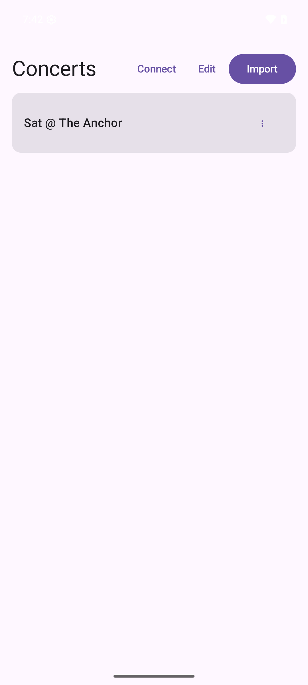
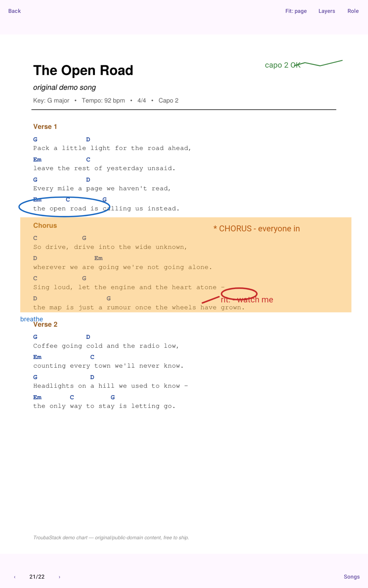
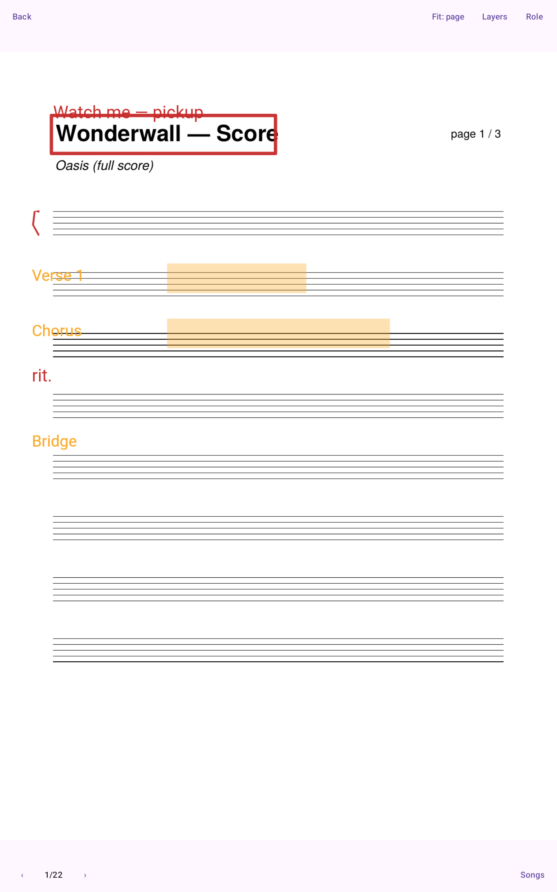

# TroubaStack

Collaborative sheet-music & lyrics annotation for bands and ensembles.

**One product (`TroubaShare`), three layers, one contract.** You *compose and annotate*
scores in a reactive web editor (**TroubaStudio**); a server (**TroubaCore**) holds the single
authoritative truth and publishes performable concerts; an offline, dumb presenter
(**TroubaStage**, inside the mobile app) *performs* them on stage.

> The name is a troubadour pun, and it maps onto the architecture:
> a **troubadour** *composes* (the editor), a **joglar** *performs* (the presenter).
> See [`docs/glossary.md`](docs/glossary.md).

| TroubaStudio — annotate together, live | TroubaStage — perform offline |
|---|---|
|  |  |

---

## Read this first

| If you want to… | Read |
|---|---|
| Understand the **non-negotiable rules** | [`docs/ARCHITECTURE.md`](docs/ARCHITECTURE.md) ← the constitution |
| Understand a specific subsystem | [`docs/design/`](docs/design/) |
| Know why a decision was made | [`docs/adr/`](docs/adr/) |
| See what's being built next (agent-executable task specs) | [`docs/tasks/`](docs/tasks/) |
| Look up a term (bake, concert, layer, wet/dry ink…) | [`docs/glossary.md`](docs/glossary.md) |

**The golden rule:** [`docs/ARCHITECTURE.md`](docs/ARCHITECTURE.md) lists numbered
**invariants (I1…In)**. Everything in `docs/design/` and every line of code *derives from*
them. If code and an invariant disagree, the code is wrong.

---

## Quick start — run the whole thing locally

Prerequisites: **Go 1.26+** and **Node 24+ / npm 11+** (that's all for the server + web editor).
Baking a setlist to a `.tstage` (B02) additionally needs **`pdftoppm`** (from `poppler-utils`)
on `PATH` for PDF page rasters — override its location with `TROUBA_PDFTOPPM` if needed.

```sh
make setup   # once: installs web/studio deps + the Playwright browser
make demo    # builds the SPA, embeds it into the Go binary, seeds demo data, serves it
```

Open **http://localhost:8080** and log in as **`marie` / `demo`** (band admin; also
`leo`, `sasha` — and `maestro`/`flora`/`cory` in the orchestra — same password).
You get two seeded bands with songs, multi-page PDFs, per-member annotation layers,
and realtime sync — open the same song in two browsers and draw.

Reset the demo data with `rm -rf core/troubadata`.


Other useful targets (`make help` lists everything):

| Command | What it does |
|---|---|
| `make dev` | development loop: Go API + Vite hot-reload SPA on :5173 |
| `make test` | Go tests (engine, stores, HTTP API) |
| `make e2e` | Playwright end-to-end suite (~56 specs, drives a real core+SPA) |
| `make check` | `go vet` + strict `gofmt` gate (same as CI) |
| `make app` | build the Android app (see below) |
| `make fixtures` | regenerate the demo/torture bundle fixtures (`core/cmd/mkbundle`) |

CI runs all of this on every push/PR: `.github/workflows/ci.yml` (go · web · proto ·
android · e2e).

---

## The mobile app — TroubaStage on your phone/tablet

The Kotlin/Compose Multiplatform app (Android now, iOS later) currently ships the
**TroubaStage presenter**: fully **offline, no account, no login** — it performs baked
concert bundles (`.tstage` files) that you import from anywhere on the device.
Hosting the Studio editor inside the app is the next planned step
([`docs/tasks/A06`](docs/tasks/A06-android-webview-studio-host.md)).

<p>
&nbsp;


On the stage-time form factor — a portrait tablet (Pixel Tablet, 1600×2560) performing the
demo, including the original song *The Open Road* with its baked Form / conductor-cue /
personal layers:

&nbsp;

</p>

### Build & install

Prerequisites: a JDK (21+) and the Android SDK (set `ANDROID_HOME`, or put
`sdk.dir=/path/to/Android/Sdk` in `app/local.properties`).

```sh
make app                      # = cd app && ./gradlew :shared:check :androidApp:assembleDebug
adb install -r app/androidApp/build/outputs/apk/debug/androidApp-debug.apk
```

No local toolchain? Every CI run on `main` also builds the APK — download it from the
GitHub Actions run (**android** job → `troubashare-debug-apk` artifact) and install it
(you'll need to allow installs from unknown sources; it's a debug build, not a store release).

### Demo it with zero servers

A baked concert with **real music and real annotations** is committed at
[`docs/demo/demo-concert.tstage`](docs/demo/demo-concert.tstage) (~545 KB — the seeded
*"Sat @ The Anchor"* setlist: Wonderwall, Hallelujah, Black Hole Sun, and the original
*The Open Road* lead sheet + tab, flattened by the real bake pipeline; see
[`docs/demo/README.md`](docs/demo/README.md) for how it's made),
so you can present the app without running anything:

```sh
adb push docs/demo/demo-concert.tstage /sdcard/Download/
```

…or just share the file to the device (mail, messenger, USB). Then in the app:
**Import** → pick `demo-concert.tstage` → open **Sat @ The Anchor** — and page through it
in airplane mode. Navigation (tap/swipe/song jump), fit modes and per-layer visibility
all work offline; the screen stays awake and the system bars hide while performing. Try
**Role → `conductor`**: the red conductor cues appear (role-targeted layers default off
for everyone else, and the mandatory section-markings layer can never be hidden). Real bundles will come from the server-side bake
([`docs/design/04-publish-pipeline.md`](docs/design/04-publish-pipeline.md)) once it lands —
the container format is specified in
[`docs/design/08-bundle-container.md`](docs/design/08-bundle-container.md).

### iOS (simulator)

TroubaStage runs on iOS too — the shared Compose UI mounts in a thin SwiftUI shell
([`app/iosApp`](app/iosApp/README.md)) via the `Shared` framework `:shared` exports. There is no Mac
in the dev loop, so iOS is **proven on GitHub's macOS runners**, not built locally: the
[`iOS (simulator)`](.github/workflows/ios.yml) workflow links the framework, builds the app
**unsigned** (`CODE_SIGNING_ALLOWED=NO` — no Apple ID or provisioning), boots a simulator, injects
the same `demo-concert.tstage`, and screenshots the Concerts list + a Stage page (uploaded as the
`ios-simulator-proof` artifact). It's **manual** (`workflow_dispatch` + a weekly cron), never
per-push — macOS runner minutes bill 10×. Physical devices / TestFlight are the next step
([`docs/tasks/IOS03`](docs/tasks/IOS03-ios-device-and-store.md)).

---

## Monorepo map

```
troubastack/
├── proto/        the CONTRACT — domain types + wire protocol (protobuf).
│                 Single source of truth for every wire type. [I1]
├── core/         TroubaCore — Go. Authoritative state, realtime sync,
│                 bake orchestration, serves the Studio SPA. [I6]
├── web/          npm workspace — all browser/JS code.
│   ├── ink/      @troubastack/ink — THE one stroke renderer. [I8]
│   ├── studio/   TroubaStudio — the canonical editor SPA. [I10]
│   └── bake/     bake worker (Node) — reuses web/ink for pixel-parity. [I8]
└── app/          TroubaShare — Kotlin/Compose Multiplatform mobile app.
                  TroubaStage presenter + (soon) Studio in a webview.
                  Native code kept to 3 seams only. [I15]
```

Dependencies point **toward the contract only**: `core`, `web/studio`, `web/bake`, and `app`
all depend on `proto`; nothing depends on a sibling client. [I14]

## Status

Actively implemented — the scaffold days are over:

- **Working today:** the Go core (append-only engine, LWW/tombstone sync, swappable
  mem/file/git stores, REST + WebSocket API), the full Studio editor (PDF viewing,
  freehand/shape/text annotation with a low-latency wet-ink path, per-member layers,
  realtime multi-user echo), and the Android TroubaStage presenter (offline, resilient,
  `.tstage` import).
- **Scaffold / next:** the server-side bake & publish pipeline, distribution/updates,
  Studio-in-the-app (A06), the native ink overlay (A07 — only if the web path proves too
  slow on a real tablet), iOS, proto codegen adoption.
- The live work queue with per-task specs is [`docs/tasks/`](docs/tasks/).

## Toolchains

Go 1.26+ · Node 24+ / npm 11+ · JDK 21+ + Android SDK (mobile app) · buf (proto lint; CI runs it).
