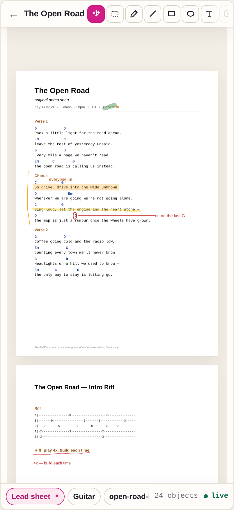
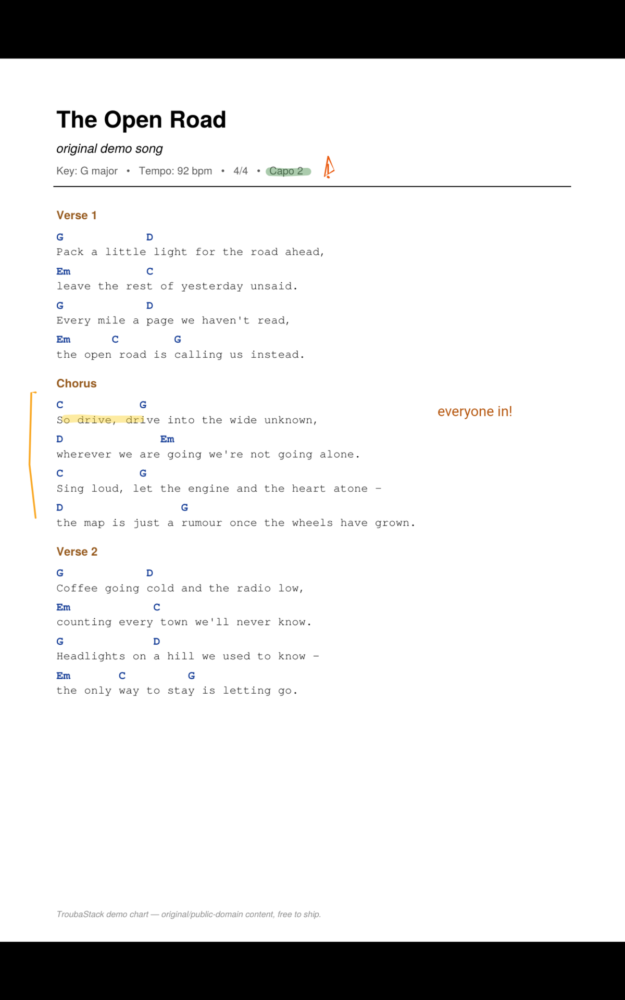
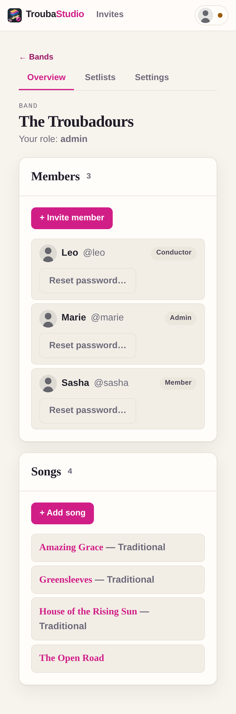
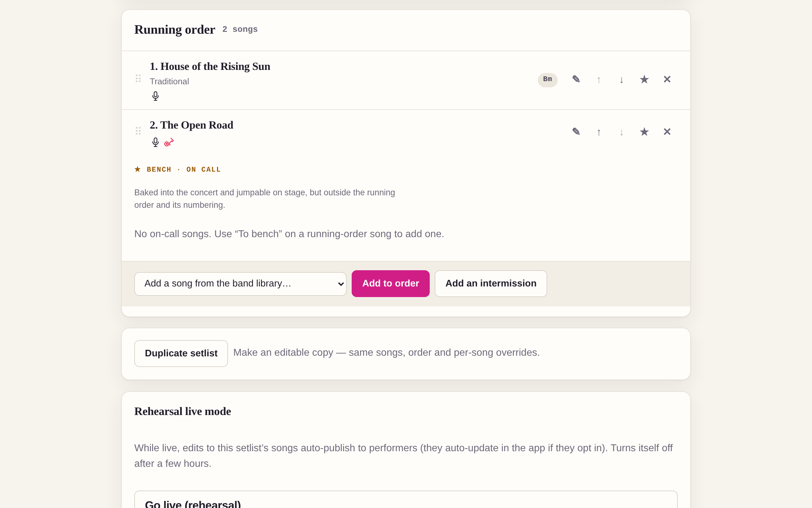
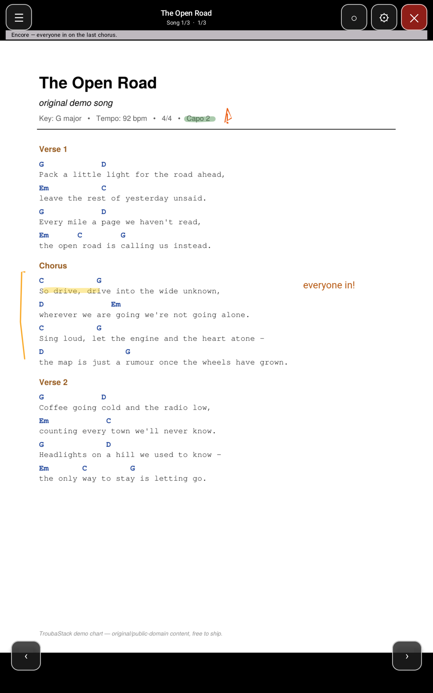

# TroubaStack

[](https://github.com/yoda-jm/troubastack/actions/workflows/ci.yml)
[](https://github.com/yoda-jm/troubastack/actions/workflows/ios.yml)


Collaborative sheet-music & lyrics annotation for bands and ensembles — from the
rehearsal-room edit to the on-stage page turn, self-hosted on a box you own.

**One product (`TroubaShare`), three layers, one contract.** You *compose and annotate*
scores in a fullscreen, canvas-first web editor (**TroubaStudio**); a server
(**TroubaCore**, one Go binary) holds the single authoritative truth, bakes setlists
into performable concert bundles, and distributes them in-app; an offline presenter
(**TroubaStage**, inside the mobile app) *performs* them on stage — pedal page turns,
night mode, count-in, facing pages, per-role layers.

> The name is a troubadour pun, and it maps onto the architecture:
> a **troubadour** *composes* (the editor), a **joglar** *performs* (the presenter).
> See [`docs/glossary.md`](docs/glossary.md).

| TroubaStudio — annotate together, live | TroubaStage — perform offline |
|---|---|
|  |  |

The full loop works end to end today: **compose → annotate (realtime, multi-user) →
bake → offer → download in-app → perform offline** — on Android, iOS (simulator-proven)
and any browser.

---

## Read this first

| If you want to… | Read |
|---|---|
| Understand the **non-negotiable rules** | [`docs/ARCHITECTURE.md`](docs/ARCHITECTURE.md) ← the constitution |
| Understand a specific subsystem | [`docs/design/`](docs/design/) |
| Know why a decision was made | [`docs/adr/`](docs/adr/) |
| See what's being built next (agent-executable task specs) | [`docs/tasks/`](docs/tasks/) |
| See what a real band can/can't do yet | [`docs/USER-JOURNEY.md`](docs/USER-JOURNEY.md) |
| Look up a term (bake, concert, layer, wet/dry ink…) | [`docs/glossary.md`](docs/glossary.md) |

**The golden rule:** [`docs/ARCHITECTURE.md`](docs/ARCHITECTURE.md) lists numbered
**invariants (I1…In)**. Everything in `docs/design/` and every line of code *derives from*
them. If code and an invariant disagree, the code is wrong.

---

## Quick start — run the whole thing locally

Prerequisites: **Go 1.26+** and **Node 24+ / npm 11+** (that's all for the server + web editor).
Baking a setlist to a `.tstage` additionally needs **`pdftoppm`** (from `poppler-utils`)
on `PATH` for PDF page rasters — override its location with `TROUBA_PDFTOPPM` if needed.

```sh
make setup   # once: installs web/studio deps + the Playwright browser
make demo    # builds the SPA, embeds it into the Go binary, seeds demo data, serves it
```

Open **http://localhost:8080** and log in as **`marie` / `demo`** (band admin; also
`leo`, `sasha` — and `maestro`/`flora`/`cory` in the orchestra — same password).
You get two seeded bands with songs, multi-page PDFs, text charts, per-member
annotation layers, conductor cues, **personal song cues** and realtime sync — open the
same song in two browsers and draw.

Reset the demo data with `rm -rf core/troubadata`.



Each member sets their own **song cues** — a small set of tinted instrument/role icons
per song (Marie's *"Sat @ The Anchor"* below: mic + red electric on The Open Road, mic on
Amazing Grace, …) — shown on the setlist row and flashed on song entry in the app, so a
player knows at a glance what to prepare. They ride that member's personal bake.



Other useful targets (`make help` lists everything):

| Command | What it does |
|---|---|
| `make dev` | development loop: Go API + Vite hot-reload SPA on :5173 |
| `make test` | Go tests (engine, stores, HTTP API, bake) |
| `make e2e` | Playwright end-to-end suite (~80 specs, drives a real core+SPA) |
| `make check` | `go vet` + strict `gofmt` gate (same as CI) |
| `make app` | build the Android app (see below) |
| `make fixtures` | regenerate the demo/torture bundle fixtures (`core/cmd/mkbundle`) |

CI runs all of this on every push/PR: `.github/workflows/ci.yml` (go · web · proto ·
android · e2e — all five gate the merge).

---

## Install it for real — Docker, on a box you own

`make demo` is local-only over `http://localhost`. To run TroubaStack for a real band —
HTTPS on a home server or a cheap VPS, one binary behind Caddy with automatic
Let's Encrypt certificates, all state in one backed-up data dir — see
**[`deploy/`](deploy/README.md)**:

```sh
cp deploy/.env.example deploy/.env    # set DOMAIN=band.example.org
cd deploy && docker compose up -d     # builds the image, provisions TLS, serves
```

The [`Dockerfile`](Dockerfile) is multi-stage (SPA embedded at compile time; the
runtime can bake — poppler + the Node bake worker included; non-root). Backups are a
single `tar` of the data dir ([`deploy/backup.sh`](deploy/backup.sh), restore path
tested). A plain **systemd** variant (no docker) is documented in the same README.

**Packaging status (honest):** the compose build above is the supported install.
There is no published registry image, no GitHub Releases binary, and no store/F-Droid
APK yet — CI builds a **debug APK** artifact on every push (below), and a signed
release APK is the remaining half of the deploy story
([`docs/tasks/OPS01`](docs/tasks/OPS01-production-serving.md)).

---

## The mobile app — TroubaStage on your phone/tablet

The Kotlin/Compose Multiplatform app (Android now, iOS in simulator) ships the
**TroubaStage presenter** — fully **offline, no account, no login** — plus the
in-app distribution loop: connect to your band's server (mDNS discovery on the LAN),
browse offered concerts, download and perform them. Stage-time ergonomics are real:
pedal/volume-key page turns, night mode, count-in, facing pages on wide tablets,
per-role layer defaults, a song drawer, and the screen stays awake while performing.

On the stage-time form factor — a portrait tablet performing the committed demo bundle.
Immersive (system bars hidden, the whole screen is the score) on the left; a tap brings
back the Stage chrome on the right — song drawer, the live **♩ tempo meter**, per-role /
layer controls and the page pager:

<p>
&nbsp;

</p>

### Build & install

Prerequisites: a JDK (21+) and the Android SDK (set `ANDROID_HOME`, or put
`sdk.dir=/path/to/Android/Sdk` in `app/local.properties`).

```sh
make app                      # = cd app && ./gradlew :shared:check :androidApp:assembleDebug
adb install -r app/androidApp/build/outputs/apk/debug/androidApp-debug.apk
```

No local toolchain? Every CI run on `main` also builds the APK — download it from the
GitHub Actions run (**android** job → `troubashare-debug-apk` artifact) and install it
(you'll need to allow installs from unknown sources; it's a debug build, not a store release).

### Demo it with zero servers

A baked concert with **real music and real annotations** is committed at
[`docs/demo/demo-concert.tstage`](docs/demo/demo-concert.tstage) (~356 KB — the seeded
*"Sat @ The Anchor"* setlist of copyright-safe music: the original *The Open Road*, the
traditional *House of the Rising Sun*, and *Amazing Grace* — real lead sheets, tab and
text charts, flattened by the real bake pipeline; see
[`docs/demo/README.md`](docs/demo/README.md) for how it's made),
so you can present the app without running anything. It's the **band-wide bundle** (P205):
one artifact for the whole band — it carries the roster, every layer owner-tagged, and
every member's **song cues**, and the presenter filters to the viewer's identity at view
time (a Connect auto-match or a one-tap "Who are you?" picker).

```sh
adb push docs/demo/demo-concert.tstage /sdcard/Download/
```

…or just share the file to the device (mail, messenger, USB). Then in the app:
**Import** → pick `demo-concert.tstage` → open **Sat @ The Anchor** — and page through it
in airplane mode. Navigation (tap/swipe/song jump), fit modes and per-layer visibility
all work offline; the screen stays awake and the system bars hide while performing. Try
**Role → `conductor`**: the red conductor cues appear (role-targeted layers default off
for everyone else, and the mandatory section-markings layer can never be hidden).
With a running server you don't need the file at all: **Connect** finds the server on
your LAN, lists the offered concerts, and downloads them in-app
([`docs/design/04-publish-pipeline.md`](docs/design/04-publish-pipeline.md)).

### iOS (simulator)

TroubaStage runs on iOS too — the shared Compose UI mounts in a thin SwiftUI shell
([`app/iosApp`](app/iosApp/README.md)) via the `Shared` framework `:shared` exports. There is no Mac
in the dev loop, so iOS is **proven on GitHub's macOS runners**, not built locally: the
[`iOS (simulator)`](.github/workflows/ios.yml) workflow links the framework, builds the app
**unsigned** (`CODE_SIGNING_ALLOWED=NO` — no Apple ID or provisioning), boots a simulator, injects
the same `demo-concert.tstage`, and screenshots the Concerts list + a Stage page (uploaded as the
`ios-simulator-proof` artifact). It's **manual** (`workflow_dispatch` + a weekly cron), never
per-push — macOS runner minutes bill 10×. Physical devices / TestFlight are the next step
([`docs/tasks/IOS03`](docs/tasks/IOS03-ios-device-and-store.md)).

---

## Monorepo map

```
troubastack/
├── proto/        the CONTRACT — domain types + wire protocol (protobuf).
│                 Single source of truth for every wire type. [I1]
├── core/         TroubaCore — Go. Authoritative state, realtime sync,
│                 bake orchestration, serves the Studio SPA. [I6]
├── web/          npm workspace — all browser/JS code.
│   ├── ink/      @troubastack/ink — THE one stroke renderer. [I8]
│   ├── studio/   TroubaStudio — the canonical editor SPA. [I10]
│   └── bake/     bake worker (Node) — reuses web/ink for pixel-parity. [I8]
├── app/          TroubaShare — Kotlin/Compose Multiplatform mobile app.
│                 TroubaStage presenter + Studio in a webview.
│                 Native code kept to 3 seams only. [I15]
└── deploy/       single-box production serving: compose + Caddy/TLS + backups.
```

Dependencies point **toward the contract only**: `core`, `web/studio`, `web/bake`, and `app`
all depend on `proto`; nothing depends on a sibling client. [I14]

## Status

The product loop is closed and CI-gated end to end:

- **The editor:** fullscreen, canvas-first — Ctrl/⌘-wheel and two-finger pinch
  zoom-to-cursor (one raster per gesture), low-latency wet ink, per-member layers,
  per-object z-order with a selection toolbar, shapes/text/highlights with presets,
  realtime multi-user echo, offline honesty (read-only presentation + visible
  errors — nothing dies silently), text charts alongside PDFs with **chord
  transposition** (transpose a chart to any key — line-count-preserving so existing
  annotations stay anchored — in the editor, or per setlist item burned in at bake),
  **personal song cues** (per-member icon+color reminders — "mic + red guitar" — that
  ride the band bake, tagged per member), animated drag-reorder setlists (titles link to the song),
  duplication, admin password reset, and a top-right account menu (profile · get the
  app · build/version-mismatch check · log out).
- **The pipeline:** server-side bake (concurrent-safe, one band-wide bundle per setlist,
  encore/bench songs, retention via `troubacore gc`), in-app offer/download distribution,
  **rehearsal live mode** (opt-in: annotation edits debounce-autobake and, for a performer
  who opts in on Stage, auto-update the open concert in place — viewport-preserving, so
  the page doesn't jump), and the committed demo bundle above — studio pixels and baked
  pixels come from the same renderer (I8) and are parity-tested.
- **The presenter:** Android + iOS-simulator TroubaStage with the stage ergonomics
  arc (A08–A15) landed: metadata strip, pedal page turns, night mode, count-in,
  facing pages, scroll mode, song drawer.
- **Production serving:** the [`deploy/`](deploy/README.md) story above (compose +
  Caddy/TLS + tested backups) — the attended first bring-up and the signed release
  APK are the remaining steps.
- **Next / open:** the live work queue with per-task specs is
  [`docs/tasks/`](docs/tasks/) (§ *Queue state*); the honest gap register is
  [`docs/USER-JOURNEY.md`](docs/USER-JOURNEY.md).

## Toolchains

Go 1.26+ · Node 24+ / npm 11+ · JDK 21+ + Android SDK (mobile app) · buf (proto lint; CI runs it).
